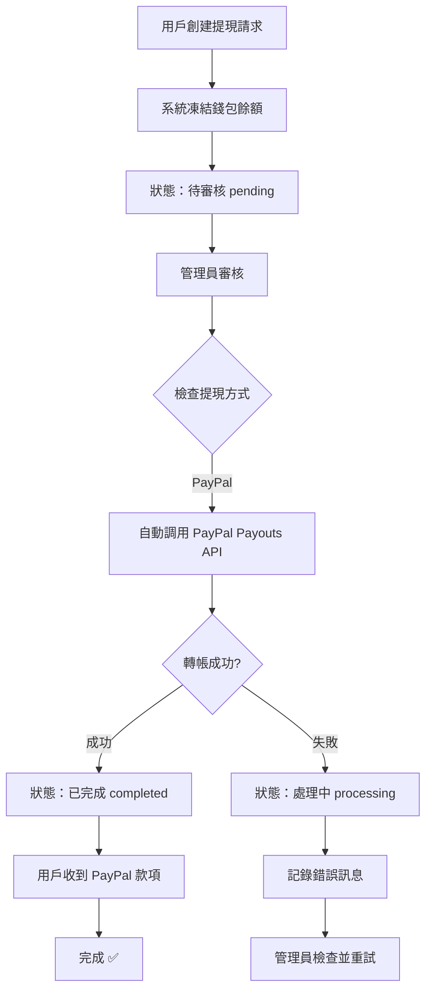
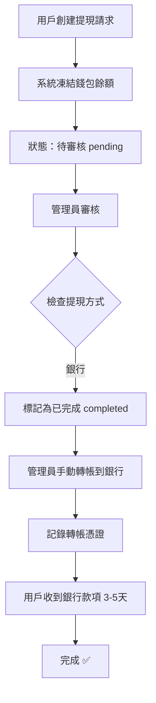

# ✅ 自動提現功能實現總結

## 📋 實現概覽

已成功為 Case Where 平台整合 **PayPal Payouts API 自動提現**功能，並在用戶端添加了清晰的提示訊息，告知銀行轉帳功能即將推出。

---

## 🎯 已完成功能

### 1️⃣ **PayPal Payouts API 整合** ✅
**文件：** `/supabase/functions/server/paypal_service.tsx`

新增功能：
- ✅ `createPayout()` - 自動轉帳到 PayPal 帳戶
  - 支援 $1 - $20,000 USD 單筆提現
  - 自動生成唯一批次 ID
  - 完整的錯誤處理
  - 記錄轉帳狀態到 KV Store

- ✅ `checkPayoutStatus()` - 查詢轉帳狀態
  - 即時查詢 PayPal 轉帳進度
  - 返回詳細的批次和項目狀態

### 2️⃣ **管理員自動批准提現** ✅
**文件：** `/supabase/functions/server/index.tsx`

**路由：** `POST /make-server-215f78a5/withdrawals/:id/approve`

新增邏輯：
```typescript
if (withdrawal.method_type === 'paypal') {
  // 🎯 自動調用 PayPal Payouts API
  const payoutResult = await createPayout(
    method.paypal_email,
    withdrawal.net_amount,
    `Withdrawal from Case Where - Request ${withdrawalId}`,
    withdrawalId
  );
  
  if (payoutResult.success) {
    // ✅ 記錄 PayPal 轉帳 ID
    withdrawal.payout_batch_id = payoutResult.payoutBatchId;
    withdrawal.payout_item_id = payoutResult.payoutItemId;
    withdrawal.payout_method = 'paypal_auto';
    withdrawal.status = 'completed';
  } else {
    // ❌ 轉帳失敗，標記為處理中
    withdrawal.payout_error = payoutResult.error;
    withdrawal.payout_method = 'paypal_auto_failed';
    withdrawal.status = 'processing';
  }
} else {
  // 🏦 銀行轉帳 - 手動處理
  withdrawal.payout_method = 'manual';
  withdrawal.status = 'completed';
}
```

### 3️⃣ **用戶端提示訊息** ✅

#### A. 添加銀行帳戶對話框
**文件：** `/components/AddInternationalBankDialog.tsx`

新增提示：
- ⚠️ **三語提示**（英文、繁中、簡中）：
  ```
  EN: "⚠️ Bank transfer withdrawals are not yet available. 
       Currently, only PayPal instant withdrawals are supported. 
       Bank transfer functionality is coming soon!"
  
  繁中：「⚠️ 銀行轉帳提現功能尚未開放。
         目前僅支援 PayPal 即時提現，銀行轉帳功能即將推出！」
  
  簡中：「⚠️ 银行转账提现功能尚未开放。
         目前仅支持 PayPal 即时提现，银行转账功能即将推出！」
  ```

- 💡 **推薦使用 PayPal**：
  ```
  EN: "We recommend using PayPal for instant withdrawals."
  繁中：「建議使用 PayPal 進行即時提現。」
  簡中：「建议使用 PayPal 进行即时提现。」
  ```

#### B. 提現請求頁面
**文件：** `/components/WithdrawalRequest.tsx`

新增藍色提示框：
```tsx
<Alert className="bg-blue-50 border-blue-200">
  <Info className="h-4 w-4 text-blue-600" />
  <AlertDescription className="text-xs space-y-2">
    <p className="font-semibold text-blue-900">
      {t.paypalInstant}  {/* ⚡ PayPal：即時提現（幾分鐘內到帳）*/}
    </p>
    <p className="text-orange-700">
      {t.bankComingSoon} {/* 🏦 銀行轉帳：即將推出（目前為手動處理）*/}
    </p>
    <p className="text-blue-700">
      {t.recommendPayPal} {/* 建議使用 PayPal 進行即時提現 */}
    </p>
  </AlertDescription>
</Alert>
```

### 4️⃣ **完整技術文檔** ✅
**文件：** `/supabase/functions/server/WITHDRAWAL_AUTO_PAYOUT_GUIDE.md`

包含內容：
- 📖 功能概覽和支援的提現方式
- 👥 用戶端操作流程（4 步驟）
- 🔧 管理員端操作流程（3 步驟）
- 📊 提現狀態說明（pending、processing、completed、rejected）
- ⚠️ PayPal 自動轉帳失敗處理
- 🔐 安全性說明
- 🧪 測試步驟（Sandbox 和 Production）
- 💡 最佳實踐
- 🆘 常見問題 FAQ

---

## 🔄 **完整提現流程**

### PayPal 自動提現流程



### 銀行手動提現流程



---

## 📊 **數據結構更新**

### Withdrawal 對象新增欄位

```typescript
interface Withdrawal {
  // ... 原有欄位 ...
  
  // 💸 PayPal 自動轉帳資訊（新增）
  payout_batch_id?: string;      // PayPal 批次 ID
  payout_item_id?: string;        // PayPal 項目 ID
  payout_status?: string;         // PayPal 轉帳狀態
  payout_method?: string;         // 'paypal_auto' | 'manual' | 'paypal_auto_failed'
  payout_error?: string;          // 錯誤訊息（如果失敗）
}
```

### PayPal Payout KV Store

```typescript
// Key: paypal_payout:{withdrawal_id}
{
  payoutBatchId: string;        // PayPal 批次 ID
  payoutItemId: string;         // PayPal 項目 ID
  paypalEmail: string;          // 收款 PayPal 郵箱
  amount: number;               // 轉帳金額 (USD)
  status: string;               // 批次狀態
  withdrawalId: string;         // 關聯的提現請求 ID
  createdAt: string;            // 創建時間
}
```

---

## 🧪 **測試清單**

### PayPal Sandbox 測試

- [ ] 設定環境變數 `PAYPAL_MODE=sandbox`
- [ ] 創建 PayPal Sandbox Business 帳戶
- [ ] 創建 PayPal Sandbox Personal 帳戶
- [ ] 使用 Personal 郵箱創建提現請求
- [ ] 管理員批准提現
- [ ] 確認 PayPal Sandbox 帳戶收到款項
- [ ] 檢查 `payout_batch_id` 是否記錄
- [ ] 測試提現失敗情況（錯誤郵箱）

### Production 上線前檢查

- [ ] PayPal Business 帳戶已驗證
- [ ] 已申請並開通 Payouts API 權限
- [ ] 環境變數設定為 `PAYPAL_MODE=live`
- [ ] 環境變數 `PAYPAL_CLIENT_ID` 和 `PAYPAL_CLIENT_SECRET` 已設定
- [ ] 測試小額提現（$1-10 USD）
- [ ] 確認郵件通知正常
- [ ] 監控錯誤日誌
- [ ] 設定提現限額和風控規則

---

## ⚠️ **重要提醒**

### 目前狀態

✅ **已實現：**
- PayPal 自動提現
- 用戶端提示訊息
- 完整的錯誤處理
- 詳細的日誌記錄

⏳ **未實現（即將推出）：**
- 銀行自動轉帳（需要銀行 API 或 ECPay 代付款）
- 批次提現處理（一次處理多筆）
- 提現通知郵件（可選）

### 銀行轉帳的未來方案

#### 方案 A：ECPay 代付款（推薦）
- 向 ECPay 申請「代付款」功能
- 需要額外審核和手續費
- 可以自動轉帳到台灣銀行帳戶

#### 方案 B：銀行 API 整合
- 直接整合玉山銀行或其他銀行的 API
- 需要企業帳戶和 API 授權
- 開發和測試時間較長

#### 方案 C：手動批次轉帳（目前）
- 管理員定期處理提現
- 使用網路銀行批次轉帳
- 手動更新提現狀態

---

## 📞 **後續支援**

如需幫助實現：
1. ✅ ECPay 代付款整合
2. ✅ 銀行 API 整合
3. ✅ 批次提現處理
4. ✅ 提現通知郵件
5. ✅ PayPal Sandbox 環境設定

請隨時聯繫！🚀

---

**版本：** v1.0  
**更新日期：** 2026/01/08  
**作者：** AI Assistant (Claude)  
**項目：** Case Where 接得準公司平台
